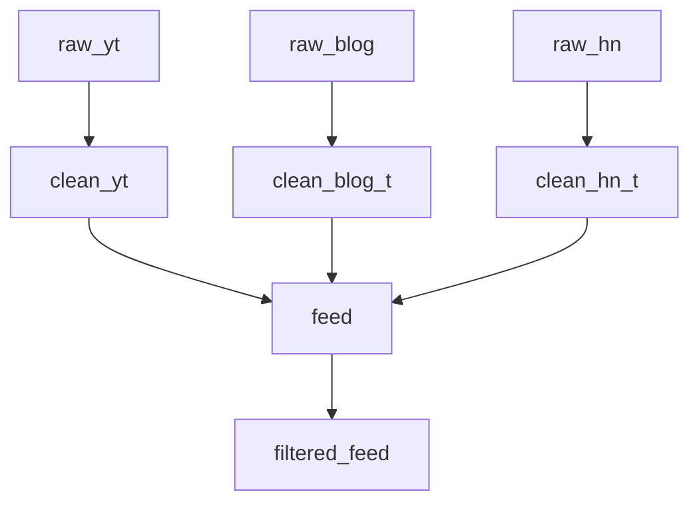

# Fan-out and fan-in

`Source.full_pipeline(...)` composes any number of pipelines into a DAG.
Pipelines that share a source topic become **siblings** (fan-out); a
target that is another pipeline's source forms a **chain** (fan-in).

```python
source.full_pipeline(
    raw_yt.pipe(clean_youtube).to(clean_yt),
    raw_blog.pipe(clean_blog).to(clean_blog_t),
    raw_hn.pipe(clean_hn).to(clean_hn_t),
    clean_yt.pipe(to_feed).to(feed),
    clean_blog_t.pipe(to_feed).to(feed),
    clean_hn_t.pipe(to_feed).to(feed),
    feed.pipe(score_filter).to(filtered_feed),
).run()
```



Source topics are processed in topological order, so a downstream
pipeline sees the rows produced upstream within the same `run()` call.

## Strategies

`FullPipeline.run(strategy=...)` accepts two values.

### `"strict"` (default)

All sibling transforms for a given parent row are computed in memory,
then their inserts and the parent ack happen inside one SQLite
transaction. Any exception aborts the whole run with no partial state —
no rows are written and no records are acked.

### `"best_effort"`

Each sibling runs in isolation. Failures are captured into
`FanOutFailure` records (record id, source name, target name, exception)
and the parent row is acked **only** if every sibling succeeded. After
the run finishes, any collected failures raise `FanOutError`:

```python
try:
    source.full_pipeline(...).run(strategy="best_effort")
except FanOutError as exc:
    for failure in exc.failures:
        print(failure.source, "->", failure.target, failure.exception)
```

Successful sibling writes are preserved. Parent rows with any failed
sibling stay `new` so a corrected re-run can retry them.

## Cycles

A cycle in the DAG raises `ValueError("pipeline contains a cycle")` when
`run()` is called.
