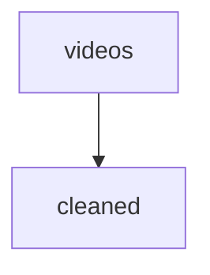

# Pipelines

A `Pipeline` is a single-source, single-target transformation between two
topics. Build one with `topic.pipe(fn)` and chain `.to(target)`.

```python
videos.pipe(clean).to(cleaned).run()
```

## Anatomy of a run

For each `new` row in the source topic:

1. The payload is decoded into the source model.
2. `fn(model)` is called.
3. If the result is `None`, the source row is acked and nothing is written.
4. Otherwise the result is validated against the **target** model.
5. Inside one SQLite transaction: the target row is inserted and the
   source row is transitioned to `handled`.

A `DuplicateMessageError` from the target rolls back that row's
transaction, so the source row remains `new` and can be retried.

## Return values

`Pipeline.run` returns the list of transformed outputs in source-row
order. Without a `.to(target)`, this is just the raw return value of `fn`
— useful for ad-hoc summaries:

```python
sums = source.topic("sums", Sum).pipe(lambda x: x.value).run()
```

## Dry runs

`run(dry_run=True)` calls `fn` and validates the outputs but does not
write to the target or transition source rows. Handy for previewing a
transformation before committing it.

## Plotting

`Pipeline.plot()` returns a Mermaid `graph TD` string:

```python
print(videos.pipe(clean).to(cleaned).plot())
```



Drop the string into a fenced ```mermaid``` block to render the diagram
inside this documentation site.

## Targeting topics by name

If the target topic is already registered on the `Source`, you can pass
its name as a string:

```python
videos.pipe(clean).to("cleaned").run()
```

The pipeline resolves the name against the `Source`'s registry, raising
`KeyError` if the topic was never created on that source.
