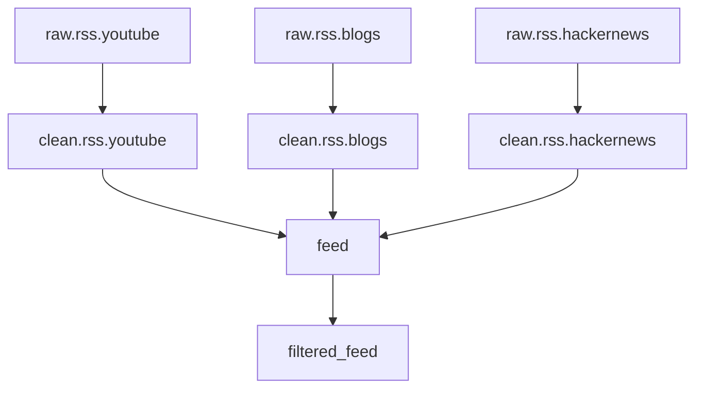

# RSS pipeline example

A full multi-source ETL pipeline that pulls from three "raw" RSS topics
(YouTube, blogs, HackerNews), cleans each into a uniform `CleanItem`,
scores them into a unified `feed`, and finally filters into a
`filtered_feed` topic.

The complete script lives in
[`examples/rss_pipeline.py`](https://github.com/koaning/minikafka/blob/main/examples/rss_pipeline.py).
Run it with:

```bash
uv run python examples/rss_pipeline.py
```

## The DAG



Three sibling cleaners read from separate raw topics into per-source
`clean.*` topics. Three more siblings score them into a single `feed`,
and one final pipeline filters by score into `filtered_feed`.

## Topic models

```python
class RawYouTube(BaseModel):
    creator: str
    title: str
    url: str
    length_seconds: int
    raw_description: str


class CleanItem(BaseModel):
    source: str
    author: str
    title: str
    url: str
    summary: str


class FeedItem(BaseModel):
    source: str
    author: str
    title: str
    url: str
    summary: str
    score: int
```

`CleanItem` is reused by all three cleaners — the `source` field
distinguishes them.

## Wiring the pipeline

```python
src.full_pipeline(
    raw_yt.pipe(clean_youtube).to(clean_yt),
    raw_blog.pipe(clean_blog).to(clean_blog_t),
    raw_hn.pipe(clean_hn).to(clean_hn_t),
    clean_yt.pipe(youtube_to_feed).to(feed),
    clean_blog_t.pipe(blog_to_feed).to(feed),
    clean_hn_t.pipe(hn_to_feed).to(feed),
    feed.pipe(score_filter).to(filtered_feed),
).run()
```

Note that the score filter returns `FeedItem | None`. Returning `None`
acks the source record without writing anything to `filtered_feed` — a
natural way to express "drop this row".

## Observing events

The script passes `on_event=log` to `Source` so every `topic_created`,
`message_appended`, `pipeline_start`, and `pipeline_end` is printed. This
is also the easiest way to inspect what a `FullPipeline` is doing during
a long run.
