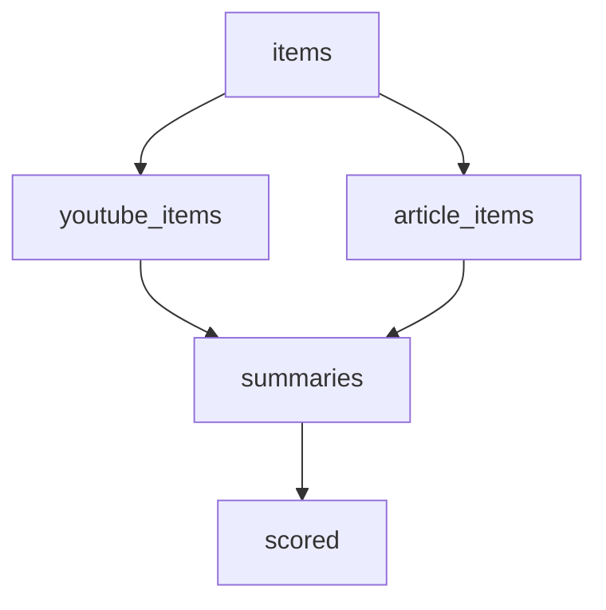

# minikafka

**minikafka** is a tiny typed queue backed by SQLite, built for the kind
of single-machine homelab where a dozen little pipelines slowly accumulate
over time.

## Why this exists

You've probably been here: a cron pulls some
RSS feeds, another script summarizes them with a local LLM, a third
shoves the result into your reader. Maybe you start by writing stuff
into files here and there, or maybe some tables with schemas if you
want to get fancy. 

Then comes the moment when you want to expand. Maybe you want the RSS
feed to go to another pipeline if it contains a YouTube video. Suddely
it starts to be hard to keep everything in your head. What did the scraper 
already see? Which items were summarized? Which ones failed and need a retry? 

You want to keep things simple so you don't want to double-down on something 
like Kafka. You might want to introduce prefect, sure, but that's just for 
scheduling. It does not answer "what's the durable state between runs?"

That's the gap minikafka fills. A `Source` is one SQLite file on disk.
A `Topic` is a typed, append-only log inside that file. Pipelines
consume one topic and produce another. It's all transactionally, so a crash in
the middle of an LLM call doesn't leave the next run confused. Pair it
with Prefect (or just cron) for the *when*, and let minikafka own the
*what's-already-done*.

It makes small homelab projects *loads* of fun.

## What you get

- **Typed topics** — every queue is anchored to a Pydantic model and the
  database stores the JSON schema so reopens are guarded.
- **Append-only logs** — records start as `new` and transition to
  `handled` on ack; you can replay either set.
- **Optional dedup** — pick a tuple of fields and the queue enforces
  uniqueness in SQLite (so re-running yesterday's RSS scrape is a no-op).
- **Composable pipelines** — chain transformations with
  `topic.pipe(fn).to(other)` or fan out / in with
  `Source.full_pipeline(...)`.
- **One required dependency** — `pydantic`. Polars and marimo are
  optional extras.

## Install

```bash
uv add minikafka
```

## A 10-line tour

A homelab RSS pipeline: a raw topic holds items pulled from a feed, and
a `summaries` topic holds the LLM-summarized version of each item.

```python
from pydantic import BaseModel
from minikafka import Source


class RssItem(BaseModel):
    url: str
    title: str
    body: str


class Summary(BaseModel):
    url: str
    title: str
    llm_summary: str


def llm_summary(item: RssItem) -> Summary:
    # pretend this calls a local model
    return Summary(
        url=item.url,
        title=item.title,
        llm_summary=item.body[:200] + "...",
    )


source = Source("homelab.sqlite")  # one file on disk, survives restarts
items = source.topic("rss.items", RssItem, dedup=("url",))
summaries = source.topic("rss.summaries", Summary, dedup=("url",))

items.append({
    "url": "https://example.com/post-1",
    "title": "Hello, homelab",
    "body": "A long post about running things at home...",
})

items.pipe(llm_summary).to(summaries).run()

for s in summaries.iter_new():
    print(s.title, "->", s.llm_summary)
```

The next time this script runs, the `dedup=("url",)` constraint on
`items` makes the same RSS URL a no-op, and `summaries` only sees rows
the pipeline hasn't already handled. The whole thing is one
`homelab.sqlite` file — back it up like any other.

## Going bigger?

Once you have a few topics it usually doesn't stop at one
`topic.pipe(...)`. Maybe you want a parser to split YouTube items off
from regular RSS, a cleaner for each branch, and a scorer that fans
back in. That's where `Source.full_pipeline(...)` comes in: pass any
number of `topic.pipe(fn).to(target)` arms and minikafka runs them as
one DAG, in topological order, with one shared transaction per row.

```python
source.full_pipeline(
    items.pipe(split_youtube).to(youtube_items),
    items.pipe(keep_articles).to(article_items),
    youtube_items.pipe(transcribe).to(summaries),
    article_items.pipe(llm_summary).to(summaries),
    summaries.pipe(score).to(scored),
).run()
```



Two siblings fan out from `items`, two more fan back in to `summaries`,
and `score` runs downstream — all from a single call. Add
`strategy="best_effort"` if you'd rather collect failures than abort the
whole run (handy when one of your LLM calls is flaky).

See [Fan-out & fan-in](concepts/fan-out.md) for the strict vs.
best-effort tradeoff, retry semantics, and `FanOutError` details.

## Next steps

- [Quickstart](quickstart.md) — append, iterate, ack, and compose.
- [Concepts](concepts/topics.md) — topics, pipelines, fan-out semantics.
- [API reference](reference/index.md) — every public class and method.
